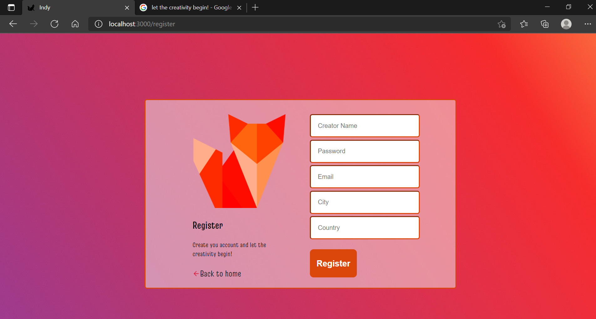

	

<h1 align="center">Indy: The Creativity Bank</h1>

## Status

<h4 align="center"> 
	Indy - Finished! ✅
</h4>

## Description

Indy is an application that works as a creativity bank. Users are invited, after logging in, to register their creations so that they can organize themselves. These creations can be quite diverse, like music and applications.

## Content

- [Description](#description)
- [Status](#status)
- [Content](#content)
- [How to use it?](#how-to-use-it)
- [Stack and Technoloy](#stack-and-technology)
- [ApplicationPhotos](#application-photos)

## How to use it?

Indy is a full stack project.

1. Clone the repository
2. "npm install" in front-end and back-end folders
3. "npm start" in front-end and back-end folders

## Stack and Technology

- React JS
- Node.js
- SQLite

## Application Photos

